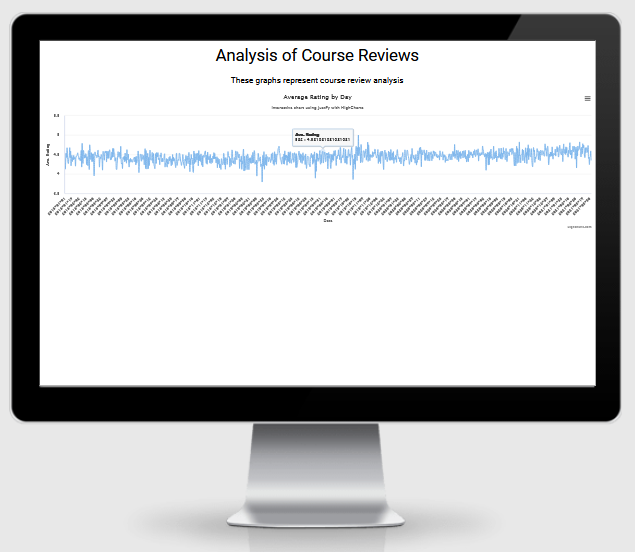
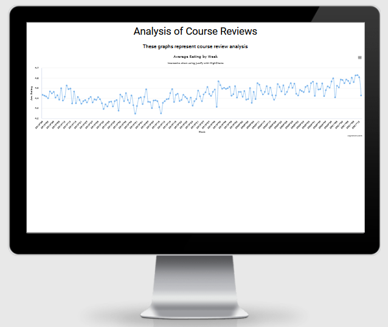
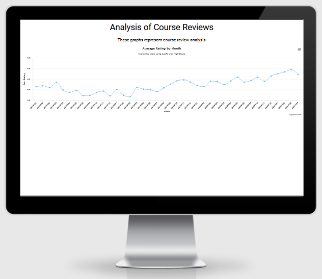

# Data Analysis and Visualisation

## About ##

This coding example is part of a Udemy Python course using Python Pandas library with JustPy to plot dataframes graphs onto web pages for data visualisation.
The source data is imported into a Pandas DataFrame from a .csv file and presented on a web page using JustPy Quasar pages and HighCharts.

---

## Technologies ##

### **Languages** ###

- [Python3](https://www.python.org/)
  - Used to create the main application functionality

### **Libraries** ###

- [Pandas](https://pandas.pydata.org/docs/)
  - Used to manipulate raw data from a  csv file in a DataFrame
- [JustPy](https://justpy.io/)
  - Quasar WebPages are used to render http output pages
  - HighCharts JS code is used to render the charts within the WebPage.

### **Tools** ###

- [Jupyter Notebook](https://jupyter.org/)
  - Used to create the code and explanation

---

## Deployment ##

The website was developed using Gitpod using Git pushed to GitHub, which hosts the repository. I made the following steps to deploy the site:

### **Cloning Webmap_Volcanoes_Population from GitHub** ###

#### **Prerequisites** ###

Ensure the following are installed locally on your computer:

- [Python 3.6 or higher](https://www.python.org/downloads/)
- [PIP3](https://pypi.org/project/pip/) Python package installer
- [Git](https://git-scm.com/) Version Control

#### **Cloning the GitHub repository** ####

- navigate to [simonjvardy/Data_Analysis_and_Visualisation](https://github.com/simonjvardy/Data_Analysis_and_Visualisation) GitHub repository.
- Click the **Code** button
- **Copy** the clone url in the dropdown menu
- Using your favourite IDE open up your preferred terminal.
- **Navigate** to your desired file location.

Copy the following code and input it into your terminal to clone Sportswear-Online:

```Python
git clone https://github.com/simonjvardy/Data_Analysis_and_Visualisation.git
```


#### **Creation of a Python Virtual Environment** ####


*Note: The process may be different depending upon your own OS - please follow this [Python help guide](https://python.readthedocs.io/en/latest/library/venv.html) to understand how to create a virtual environment.*


#### **Install the App dependencies and external libraries** ####

- In your IDE terminal window, install the dependencies from the requirements.txt file with the following command:

```Python
pip3 install -r requirements.txt
```

#### **Build the individual Quasar WebPages** ####

- In your IDE terminal window, enter:

```python
python3 1-average-rating-day.py
```

Output runs locally in a web browser using URL http://127.0.0.1:8000/ to show the Average Rating by Day graph.



```python
python3 2-average-rating-week.py
```

Output runs locally in a web browser using URL http://127.0.0.1:8000/ to show the Average Rating by Week graph.



```python
python3 3-average-rating-month.py
```

Output runs locally in a web browser using URL http://127.0.0.1:8000/ to show the Average Rating by Month graph.



---

## Acknowledgements ##

- [Udemy: The Python Mega Course - Build 10 Real World Applications](https://www.udemy.com/course/the-python-mega-course/) Credit: Ardit Sulce
